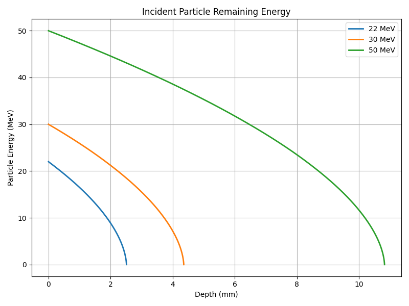

# Particle Material Interaction

This is a simple demonstration of the physics of particle-material interactions.\
In the following, it will cover stopping power, linear energy transfer and energy deposition, include the simple estimation method and Geant4 simulation.

## Stopping Power 
Unit : $MeVcm^2/g$\
Physics Definition：\
The mean energy loss of an energetic particle per unit path length in a given material\
Stopping power is obtained from the NIST STAR database：\
https://www.nist.gov/pml/stopping-power-range-tables-electrons-protons-and-helium-ions\
\
Reference：[Inokuti, M., & Argonne National Lab., IL (United States). (1995). Stopping power, its meaning, and its general characteristics.](<Reference document/Stopping power its meaning and its general characteristics.pdf>)

## Linear Energy Transfer
Unit: $MeV/cm$ or $MeV cm^2/g$\
Definition：Average energy deposited per unit length of track\
Continuous Slowing Down Approximation (CSDA)\
[Python code (plot_mode = "LET")](Stopping_power_LET_energy_deposition.py)
1. Assume the material thickness $L$. Set unit length $\Delta t=10 nm$ 
2. At $L=0$, the incident particle with energy $E =E_{0}$, the initial particle stopping power $T(E_{0})=T_{0}$ (refer to stopping power profile) 
3. At $L=\Delta t$, the incident particle energy $E_{1} =E_{0}-(T_{0}\Delta t)$, the particle stopping power $T(E_{1})=T_{1}$(refer to stopping power profile) 
4. At $L=2\Delta t$, the incident particle energy $E_{2} =E_{1}-(T_{1}\Delta t)$, the particle stopping power $T(E_{2})=T_{2}$(refer to stopping power profile) 

## Energy Deposition
LET profile integration\
Particle energy loss=particle energy deposition\
$\int_0^L {T} \ {\rm d}t$ (Estimate the energy deposition in the material)\
Particle energy remaining\
$E=E_{0}-\int_0^L {T} \ f{\rm d}t$ (Estimate the particle energy when it pass through shielding)
\
[Python code (plot_mode = "Energy Remaining")](Stopping_power_LET_energy_deposition.py)\

## Geant4 Simulation
Toolkit for the simulation of the passage of particles through matter\
Geant4：https://geant4.web.cern.ch/ \
Basic structure：https://prezi.com/i/gp3kiz0ubh3e/geant4-basic-structure/ \
Physic list document：[PhysicsListGuide](<Reference document/PhysicsListGuide.pdf>)\
Helpful tutorial：
https://www.youtube.com/playlist?list=PL1AYUn8GT4HkL09iElGRk8NRIfR3tUywQ

### Examples：DSRP
Deep Space Radiation Probe (DSRP) was developed by National Central University\
Reference :\
L. C. Chang et al., "The Deep Space Radiation Probe: Development of a first lunar science payload for space environment studies and capacity building," Advances in Space Research, 2024, doi: 10.1016/j.asr.2024.05.032.

### DSRP Model Geometry
+ Top and bottom panel：2.5 mm aluminum 
+ PCB：1.6 mm 
+ RADFET：400 nm SiO2
### Model
1. DSRP Simple Model (Based on [Geant4 basic example B1](<https://geant4-userdoc.web.cern.ch/Doxygen/examples_doc/html/ExampleB1.html>))
[Geant4 code](<DSRP reduced model>)\
 a. [DetectorConstruction](<DSRP reduced model/src/DetectorConstruction.cc>)\
 b. [PrimaryGeneratorAction](<DSRP reduced model/src/PrimaryGeneratorAction.cc>)\
 c. [Physicslist](<DSRP reduced model/exampleB1.cc>)
2. DSRP Model changing incident angle (Based on [Geant4 basic example B5](<https://geant4-userdoc.web.cern.ch/Doxygen/examples_doc/html/ExampleB5.html>))
 [Geant4 code](<DSRP model adjust the incident angle>)\
 a. [DetectorConstruction](<DSRP model adjust the incident angle/src/DetectorConstruction.cc>)\
 b. [PrimaryGeneratorAction](<DSRP model adjust the incident angle/src/PrimaryGeneratorAction.cc>)\
 c. [Physicslist](<DSRP model adjust the incident angle/exampleB1.cc>)
### Results
---
The figure shows the interactions of protons, electrons, and helium ions with the material.
From the Geant4 simulation, we can observe the contributions of secondary particles and several interesting phenomena.
+ Electrons exhibit significant scattering effects, and gamma rays generated as secondary radiation can also be observed. Since electrons have the lowest stopping power, they can penetrate the material more easily than the other particles.
+ When protons and helium ions traverse the material, secondary electrons are generated, which cannot be accurately estimated using the simple calculations discussed previously.

---
Figure (b) shows the GEANT4 simulation results for protons as the incident particle. The incident proton energy must be greater than 22 MeV to traverse the 2.5 mm aluminium shielding, which is consistent with the LET obtained by CSDA, as shown in Figure (c).The decrease in energy deposition when the incident energy increases can be explained by integrating the LET profile.\
These results demonstrate that when the incident particle is a proton, the simple method is consistent with the Geant4 simulation. Since the shielding is thin, the contribution from secondary particles can be neglected.\
\
Reference：
1. J. Allison et al., "Geant4 developments and applications," IEEE Transactions on Nuclear Science, vol. 53, no. 1, pp. 270-278, Feb. 2006, doi: 10.1109/TNS.2006.869826.
2. S. Agostinelli et al., "Geant4—a simulation toolkit," Nuclear Instruments and Methods in Physics Research Section A: Accelerators, Spectrometers, Detectors and Associated Equipment, vol. 506, no. 3, pp. 250-303, 2003/07/01/ 2003, doi: https://doi.org/10.1016/S0168-9002(03)01368-8.

