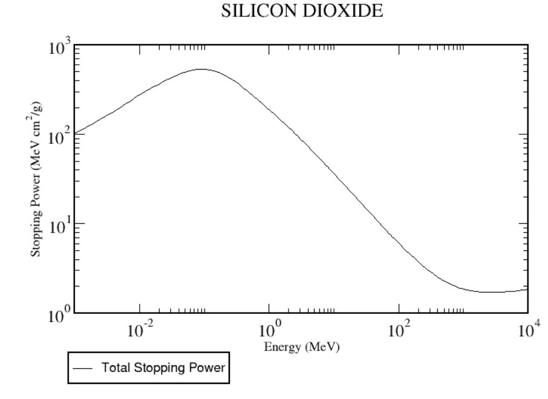
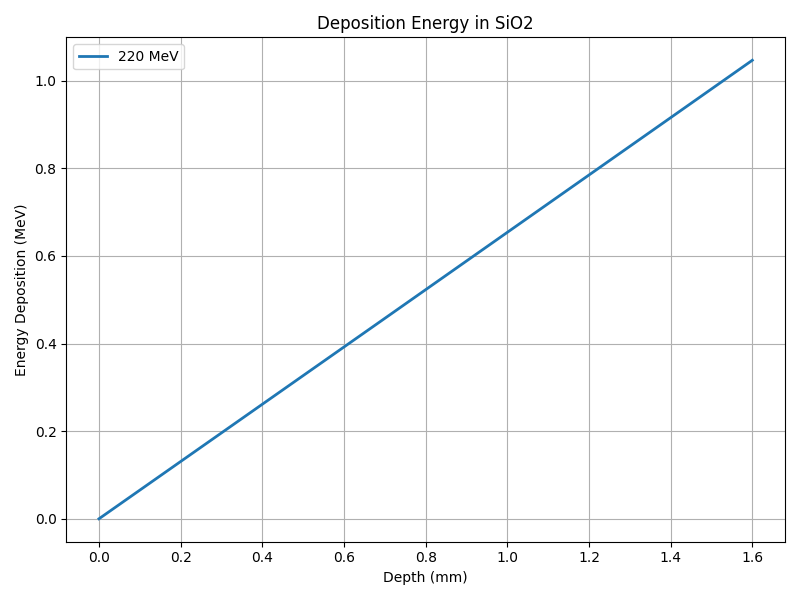
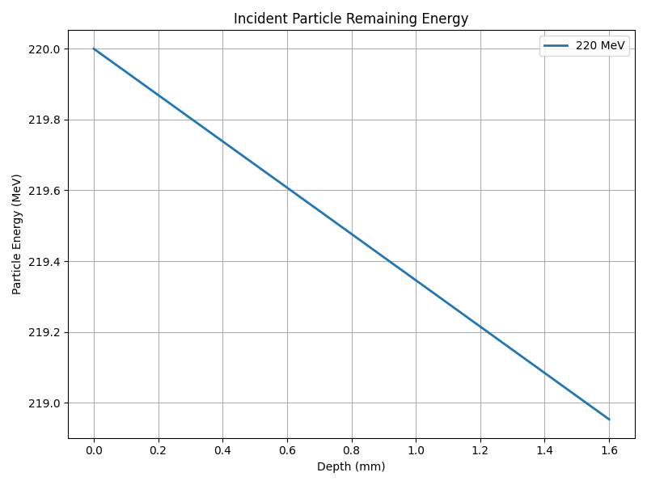

# Radiation Analysis Workflow
1. Define and simulate the environment conditons ($\frac{d\Phi}{dE}$)
    + What kinds of particle
    + What is the incident energy
2. Define and simulate the instrument fluence to deposited energy (${d(E)}$)
    + Obtain from stopping power calculation
    + Obtain from Geant4 simulation
3. Integrate the differential flux with the fluence-to-absorbed-dose relationship to calculate the absorbed dose.
   \
    $$D = \int_{0}^{\infty} d(E)\ \frac{d\Phi}{dE}\ dE$$
5. TID, TNID and SEE
    + TID \
    Electron and ion hole generated by irradiation energy deposition and accumulate over time\
    Reference：[Radiation effects and RHA: ESA internal course (4–10 May 2017) – TID	Total Ionizing Dose. CERN Indico.](<Reference document/Radiation_Effects_and_RHA_ESA_Course_TID.pdf>) 
    + TNID\
     Vacancies and interstitials migrate, either recombine ( ~90%) or migrate and form stable defects (Frenkel pair)\
     About 0.1% of total energy loss\
     Reference：[Radiation effects and RHA: ESA internal course (4–10 May 2017) – Displacement Damage & Non-Ionizing Dose (TNID/DD). CERN Indico.](<Reference document/Radiation_Effects_and_RHA_ESA_Internal_Course_TNID.pdf>) 
     + SEE\
     A high ionizind dose deposition, from a single high energy particle, occurring in a sensitive region of the device\
     Reference：[SEE tutorial: Basic mechanisms for single event effects . ESA Indico (EDHPC 2023).](<Reference document/ESA_SEE_Tutorial_Basic_Mechanisms_for_public_release.pdf>)      

## Another integrated analysis toolkit：SHIELDOSE-2
Use in STK, IRENE, SPENVIS dose estimation\
SHIELDOSE-2 does not consider the effect of detector thickness when computing doses\
\
Reference：Gentz, S. J., & Jun, I. (2023). [Space-shielding radiation dosage code evaluation phase 1: SHIELDOSE-2 radiation-assessment code (NASA/TM-20230010640). National Aeronautics and Space Administration.](<Reference document/Space-Shielding Radiation Dosage Code Evaluation.pdf>)

# Example
## DSRP Analysis
### Objective: Analysis the expected energy deposition when DSRP transverse the radiation belt
1. Environment > Radiation Belt\
Incident particle fluence by IRENE simulation
  
3. Instrument fluence to deposited energy from Geant4 simulation

4. Integration > obtain expected energy deposition
 

## ATP Test
### Objective: Estimate the energy remaining when pass through one PCB
[python code](<Stopping_power_to_energy_deposition.py>)
1. Environment > assume the proton beam energy is 220 MeV
2. Assume the PCB material is SiO2 with 1.6 mm thickness
    From the NIST STAR database：\
    https://www.nist.gov/pml/stopping-power-range-tables-electrons-protons-and-helium-ions\
    

3. The LET profile of 220 MeV proton in SiO2 as below\
    

4. Calculate the energy remaining\
   After pass through the 1.6 mm PCB material, the 220 MeV proton has approximately 218.95 MeV 
    
    
    

If the experiment aims to control the incident beam energy through the shielding configuration, a 1.6 mm PCB seems too thin.\
Plastic materials such as polyethylene may be more suitable for use as shielding control materials in proton beam tests.
